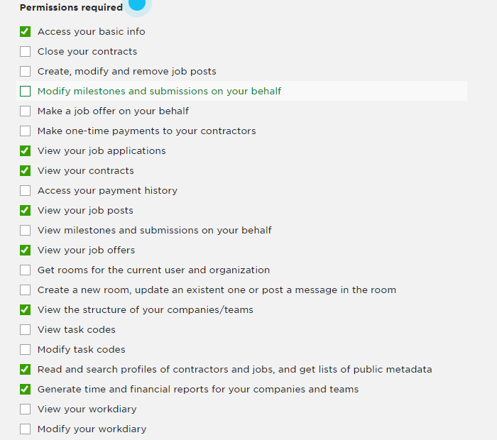
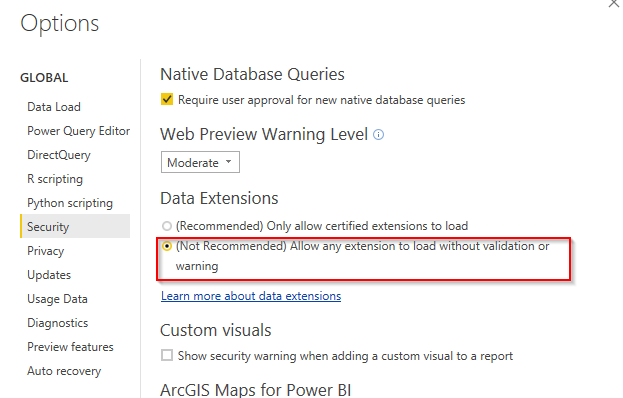
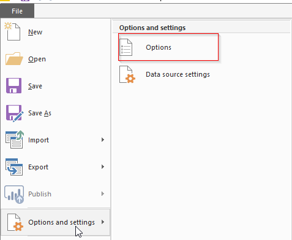
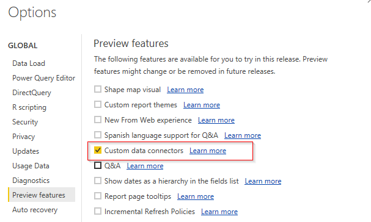
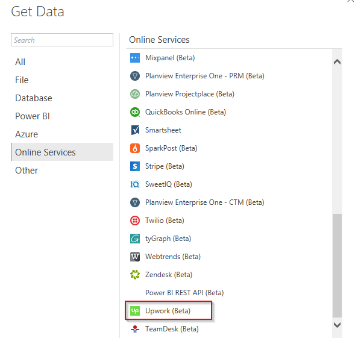
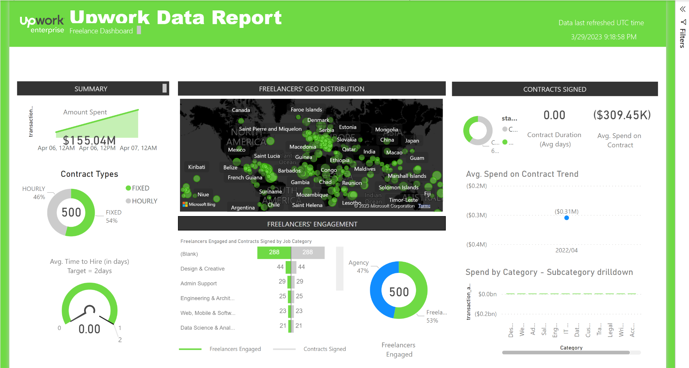

Upwork PowerBI 

Custom Connector

**Table of Contents**

[Introduction](#introduction)

[Available Data](#available-data)

[Available queries](#available-queries)

[Release notes](#release-notes)

[Setup instructions](#setup-instructions)

[Getting access to Upwork GQL APIs](#getting-access-to-upwork-gql-apis)

[Connector installation and configuration](#connector-installation-and-configuration)

[Download and configure the connector](#download-and-configure-the-connector)

[Place the connector file (.mez)](#place-the-connector-file-mez)

[Enable security options in Power BI](#enable-security-options-in-power-bi)

[Load data](#load-data)

[Available Sample Reports](#available-sample-reports)

[Troubleshooting and common issues](#troubleshooting-and-common-issues)

# Introduction

The purpose of this Power BI Custom Data Connector is to access Upwork GQL API and pull data. This custom data connector comes pre-packaged with a Power BI Report file to quickly analyze data and boost reporting capabilities.

The connector offers OAuth 2.0 authentication protocol for streamlined and secure access to Upwork APIs. Make sure you [register an OAuth 2.0 client](https://www.upwork.com/developer/documentation/graphql/api/docs/index.html#getting-started-preparation) on Upwork before accessing data through this connector. By connecting directly to the GQL APIs, the connector offers faster and more efficient access to data, eliminating the need for manual data downloads and processing. The data made available through the connector is limited to only the specific set of APIs listed by Upwork, which ensures that clients have access only to the data that is deemed necessary and relevant, enhancing their ability to generate accurate and meaningful reports.

# Available Data

## Available queries 

The data currently available through the connector includes the following set of sources with a limited set of returned data attributes/fields. Note that accessing certain data sources may require specific privileges or permissions. If you encounter any issues setting up the necessary access and permissions, we recommend checking with the [support team](https://support.upwork.com/hc/en-us) for assistance.

|       |                     |                                                                                                                                                                                   |
| ----- | ------------------- | --------------------------------------------------------------------------------------------------------------------------------------------------------------------------------- |
| **#** | **Content**         | **Description**                                                                                                                                                                   |
| 1.    | Organizations       | Maps to the company selector GQL query and provides information on companies that the user has access to.                                                                         |
| 2.    | Contracts           | Maps to the organization/clientOffers/contract GQL query and returns a list of all contracts related to the current organization.                                                 |
| 3.    | JobPosting          | Maps to the organization/jobPosting GQL query and returns a list of all job postings for the current organization.                                                                |
| 4.    | Offers              | Maps to the organization/clientOffers/offer GQL query and returns a list of all offers related to the current organization.                                                       |
| 5.    | ContractFeedbacks   | Maps to the organization/clientOffers/contract GQL query and returns only a list of all contract feedbacks related to the current organization contracts.                         |
| 6.    | ContractFreelancers | Maps to the organization/clientOffers/contract GQL query and returns only a list of all contract freelancers related to the current organization contracts                        |
| 7.    | ContractJobs        | Maps to the organization/clientOffers/contract GQL query and returns only a list of all contract jobs related to the current organization contracts.                              |
| 8.    | ContractMilestones  | Maps to the organization/clientOffers/contract GQL query and returns only a list of all contract milestones related to the current organization contracts.                        |
| 9.    | CustomFields        | Maps to the customFields GQL query and returns custom fields information for the current organization.                                                                            |
| 10.   | TransactionHistory  | Maps to the transactionHistory GQL query and returns some total data about the entire set of transactions. The result also includes groups of pending transactions, if available. |
| 11.   | AccountingEntity    | Gets accounting entity information.                                                                                                                                               |
| 12.   | CompanyStaffs       | Maps to the organization/staffs GQL query and returns information about organization staff and roles.                                                                             |

Each data point is mapped to a specific GQL query and, in some cases, may require specific parameters. The table below provides a comprehensive list of all the supported APIs and their respective parameters. It is important to make note of any specific requirements for the APIs and take the necessary steps to fulfill them.

|       |                     |                                                                                                                                                                                                                                                                                                                                                                       |
| ----- | ------------------- | --------------------------------------------------------------------------------------------------------------------------------------------------------------------------------------------------------------------------------------------------------------------------------------------------------------------------------------------------------------------- |
| **#** | **Content**         | **Parameters**                                                                                                                                                                                                                                                                                                                                                        |
| 13.   | Organizations       | \-                                                                                                                                                                                                                                                                                                                                                                    |
| 14.   | Contracts           | **dateRangeStart**, the start date of the filtration period in yyyy-mm-dd format, e.g., "2022-04-07”.**dateRangeEnd**, the end date of the filtration period in yyyy-mm-dd format, e.g., "2022-04-07".**first**, page size, or the number of elements to retrieve (default 50).**after**, the offset where to start retrieving elements from (default 0).             |
| 15.   | JobPosting          | **first**, default 50.**after**, default 0.                                                                                                                                                                                                                                                                                                                           |
| 16.   | Offers              | **dateRangeStart**, the start date of the filtration period in yyyy-mm-dd format, e.g., "2022-04-07".**dateRangeEnd**, ****the ****end date of the filtration period in yyyy-mm-dd format, e.g., "2022-04-07".**first**, page size, or the number of elements to retrieve (default 50)**after**, the offset where to start retrieving elements from (default 0)       |
| 17.   | ContractFeedbacks   | **dateRangeStart**, **the** start date of the filtration period in yyyy-mm-dd format, e.g., "2022-04-07".**dateRangeEnd**, ****the ****end date of the filtration period in yyyy-mm-dd format, e.g., "2022-04-07".**first**, page size, or the number of elements to retrieve (default 50).**after**, the offset where to start retrieving elements from (default 0). |
| 18.   | ContractFreelancers | **dateRangeStart**, ****the ****start date of the filtration period in yyyy-mm-dd format, e.g., "2022-04-07".**dateRangeEnd**, the end date of the filtration period in yyyy-mm-dd format, e.g., "2022-04-07".**first**, page size, or the number of elements to retrieve (default 50).**after**, the offset where to start retrieving elements from (default 0).     |
| 19.   | ContractJobs        | **first**, page size, or the number of elements to retrieve (default 50).**after**, the offset where to start retrieving elements from (default 0).                                                                                                                                                                                                                   |
| 20.   | ContractMilestones  | **dateRangeStart**, the start date of the filtration period in yyyy-mm-dd format, e.g., "2022-04-07".**dateRangeEnd**, end date of the filtration period in yyyy-mm-dd format, e.g., "2022-04-07".**first**, page size, or the number of elements to retrieve (default 50).**after**, the offset where to start retrieving elements from (default 0).                 |
| 21.   | CustomFields        | **limit**, page size, or the number of elements to retrieve (default 50).**offset**, the offset where to start retrieving elements from (default 0).                                                                                                                                                                                                                  |
| 22.   | TransactionHistory  | **dateRangeStart**, the start date of the filtration period in yyyy-mm-dd format, e.g., "2022-04-07".**dateRangeEnd**, the end date of the filtration period in yyyy-mm-dd format, e.g., "2022-04-07".**accountingEntityId**, accounting entity identifier retrieved by the accountingEntity query.                                                                   |
| 23.   | AccountingEntity    | \-                                                                                                                                                                                                                                                                                                                                                                    |
| 24.   | CompanyStaffs       | **first**, page size, or the number of elements to retrieve (default 50).**after**, the offset where to start retrieving elements from (default 0).                                                                                                                                                                                                                   |

# Release notes

**Apr 2023**

- First release 

# Setup instructions

Follow the steps below to set up and use the Upwork connector.

## Getting access to Upwork GQL APIs

Follow detailed instructions at <https://www.upwork.com/developer/documentation/graphql/api/docs/index.html#getting-started-preparation> 

In summary, go to Upwork API request URL, fill out project details, and submit it to get your key approved. After the key is approved, you can start pulling data.  
Here are the detailed steps:

1. Go to URL: <https://www.upwork.com/developer/keys/apply> while logged into your Upwork account.
2. Fill in the required fields.
3. Provide a call back URL: <https://oauth.powerbi.com/views/oauthredirect.html>
4. Provide API Usage. This should be set according to your expected load. You can select 500+ or 101-500 as a starting point.
5. Select Auth type as "OAuth 2.0".
6. Select the appropriate permissions. Depending on your PowerBI report(s) design, for the provided sample report to work, you need to select the following minimum permissions:  
   
7. For enterprise reporting to work, you need to select an additional permission (**Execute GQL Query under /graphql/**).
8. Submit the application for approval.

Once the keys are approved, you are now ready to install and configure the connector.

## Connector installation and configuration

### Download and configure the connector 

Follow the steps below to download and update the keys in the connector:

1. In this GitHub repo, go to the "dist" folder and download the files "Upwork.mez" and "Upwork_Report.pbit", and save them in your Desktop.
2. Using any archive editing software (e.g., [7Zip](https://www.7-zip.org/)), open the Upwork.mez file and directly edit the contents of the config.json. An alternative is to extract the .mez file, edit the .json config, and re-zip the file. 
3. Open the config.json file in Notepad or any other text file editor. Update "ClientId" with the key or consumer key, and "ClientSecret" with the secret of your key (these are the key details you got from the previous section). 
4. Save the configuration file after the updates, and make sure the updates are reflected in the archive.

### Place the connector file (.mez)

1. After you have updated the connector archive file above, copy the .mez archive file and place it under C:\\Users\\&lt;Your_User_Name>\\Documents\\Microsoft Power BI Desktop\\Custom Connectors folder.
2. Create the folders if they do not exist.

### Enable security options in Power BI

If you are using the Power BI Desktop version Oct 2018 or above, follow the instructions below to allow the Upwork connector to load. At this moment of writing, the Upwork PowerBI connector is not a certified connector; hence you need to trust it manually:

1. Open a blank Power BI Desktop file.
2. Go to File->Options and settings->Options, and select "(Not Recommended)...." under Data Extensions. See the screenshot below.

3. Restart Power BI Desktop for the change to take effect.

However, if you are using an older version (Sep 2018 or less), follow the instructions below:

1. Open a blank Power BI Desktop file.
2. Go to File->Options and settings->Options. Under "Preview features" select "Custom data connectors".

|                                                                                                                                                                                                                                                                                                                                                                                                                                                                                                                                                                                                                                                                                                                                                                                                                                                                                                                                                                                                                                                                                                                                                                                                                                                                                                                                                                                                                                                                                                                                                                                                                                                                                                                                                                                                                                                                                                                                                                                                                                                                                                                                                                                                                                                                                                                                                                                                                                                                                                                                                                                                                                                                                                                                                                                                                                                                                                                                                                                                                                                                                                                                                                                                                                                                                                                                                                                                                                                                                                                                                                                                                                                                                                                                                                                                                                                                                                                                                                                                                                                                                                                                                                                                                                                                                                                                                                                                                                                                                                                                                                                                                                                                                                                                                                                                                                                                                                                                                                                                                                                                                                                                                                                                                                                                                                                                                                                                                                                                                                                                                                                                                                                                                                                                                                                                                                                                                                                                                                                                                                                                                                                                                                                                                                                                                                                                                                                                                                                                                                                                                                                                                                                                                                                                                                                                                                                                                                                                                                                                                                                                                                                                                                                                                                                                                                                                                                                                                                                                                                                                                                                                                                                                                                                                                                                                                                                                                                                                                                                                                                                                                                                                                                                                                                                                                                                                                                                                                                                                                                                                                                                                                                                                                                                                                                                                                                                                                                                                                                                                                                                                                                                                                                                                                                                                                                                                                                                                                                                                                                                                                                                                                                                                                                                                                                                                                                                                                                                                                                                                                                                                                                                                                                                                                                                                                                                                                                                                                                                                                                                                                                                                                                                                                                                                                                                                                                                                                                                                                                                                                                                                                                                                                                                                                                                                                                                                                                                                                                                                                                                                                                                                                                                                                                                                                                                                                                                                                                                                                                                                                                                                                                                                                                                                                                                                                                                                                                                                                                                                                                                                                                                                                                                                                                                                                                                                                                                                                                                                                                                                                                                                                                                                                                                                                                                                                                                                                                                                                                                                                                                                                                                                                                                                                                                                                                                                                                                                                                                                                                                                                                                                                                                                                                                                                                                                                                                                                                                                                                                                                                                                                                                                                                                                                                                                                                                                                                                                                                                                                                                                                                                                                                                                                                                                                                                                                                                                                                                                                                                                                                                                                                                                                                                                                                                                                                                                                                                                                                                                                                                                                                                                                                                                                                                                                                                                                                                                                                                                                                                                                                                                                                                                                                                                                                                                                                                                                                                                                                                                                                                                                                                                                                                                                                                                                                                                                                                                                                                                                                                                                                                                                                                                                                                                                                                                                                                                                                                                                                                                                                                                                                                                                                                                                                                                                                                                                                                                                                                                                                                                                                                                                                                                                                                                                                                                                                                                                                                                                                                                                                                                                                                                                                                                                                                                                                                                                                                                                                                                                                                                                                                                                                                                                                                                                                                                                                                                                                                                                                                                                                                                                                                                                                                                                                                                                                                                                                                                                                                                                                                                                                                                                                                                                                                                                                                                                                                                                               
| ------------------------------------------------------------------------------------------------------------------------------------------------------------------------------------------------------------------------------------------------------------------------------------------------------------------------------------------------------------------------------------------------------------------------------------------------------------------------------------------------------------------------------------------------------------------------------------------------------------------------------------------------------------------------------------------------------------------------------------------------------------------------------------------------------------------------------------------------------------------------------------------------------------------------------------------------------------------------------------------------------------------------------------------------------------------------------------------------------------------------------------------------------------------------------------------------------------------------------------------------------------------------------------------------------------------------------------------------------------------------------------------------------------------------------------------------------------------------------------------------------------------------------------------------------------------------------------------------------------------------------------------------------------------------------------------------------------------------------------------------------------------------------------------------------------------------------------------------------------------------------------------------------------------------------------------------------------------------------------------------------------------------------------------------------------------------------------------------------------------------------------------------------------------------------------------------------------------------------------------------------------------------------------------------------------------------------------------------------------------------------------------------------------------------------------------------------------------------------------------------------------------------------------------------------------------------------------------------------------------------------------------------------------------------------------------------------------------------------------------------------------------------------------------------------------------------------------------------------------------------------------------------------------------------------------------------------------------------------------------------------------------------------------------------------------------------------------------------------------------------------------------------------------------------------------------------------------------------------------------------------------------------------------------------------------------------------------------------------------------------------------------------------------------------------------------------------------------------------------------------------------------------------------------------------------------------------------------------------------------------------------------------------------------------------------------------------------------------------------------------------------------------------------------------------------------------------------------------------------------------------------------------------------------------------------------------------------------------------------------------------------------------------------------------------------------------------------------------------------------------------------------------------------------------------------------------------------------------------------------------------------------------------------------------------------------------------------------------------------------------------------------------------------------------------------------------------------------------------------------------------------------------------------------------------------------------------------------------------------------------------------------------------------------------------------------------------------------------------------------------------------------------------------------------------------------------------------------------------------------------------------------------------------------------------------------------------------------------------------------------------------------------------------------------------------------------------------------------------------------------------------------------------------------------------------------------------------------------------------------------------------------------------------------------------------------------------------------------------------------------------------------------------------------------------------------------------------------------------------------------------------------------------------------------------------------------------------------------------------------------------------------------------------------------------------------------------------------------------------------------------------------------------------------------------------------------------------------------------------------------------------------------------------------------------------------------------------------------------------------------------------------------------------------------------------------------------------------------------------------------------------------------------------------------------------------------------------------------------------------------------------------------------------------------------------------------------------------------------------------------------------------------------------------------------------------------------------------------------------------------------------------------------------------------------------------------------------------------------------------------------------------------------------------------------------------------------------------------------------------------------------------------------------------------------------------------------------------------------------------------------------------------------------------------------------------------------------------------------------------------------------------------------------------------------------------------------------------------------------------------------------------------------------------------------------------------------------------------------------------------------------------------------------------------------------------------------------------------------------------------------------------------------------------------------------------------------------------------------------------------------------------------------------------------------------------------------------------------------------------------------------------------------------------------------------------------------------------------------------------------------------------------------------------------------------------------------------------------------------------------------------------------------------------------------------------------------------------------------------------------------------------------------------------------------------------------------------------------------------------------------------------------------------------------------------------------------------------------------------------------------------------------------------------------------------------------------------------------------------------------------------------------------------------------------------------------------------------------------------------------------------------------------------------------------------------------------------------------------------------------------------------------------------------------------------------------------------------------------------------------------------------------------------------------------------------------------------------------------------------------------------------------------------------------------------------------------------------------------------------------------------------------------------------------------------------------------------------------------------------------------------------------------------------------------------------------------------------------------------------------------------------------------------------------------------------------------------------------------------------------------------------------------------------------------------------------------------------------------------------------------------------------------------------------------------------------------------------------------------------------------------------------------------------------------------------------------------------------------------------------------------------------------------------------------------------------------------------------------------------------------------------------------------------------------------------------------------------------------------------------------------------------------------------------------------------------------------------------------------------------------------------------------------------------------------------------------------------------------------------------------------------------------------------------------------------------------------------------------------------------------------------------------------------------------------------------------------------------------------------------------------------------------------------------------------------------------------------------------------------------------------------------------------------------------------------------------------------------------------------------------------------------------------------------------------------------------------------------------------------------------------------------------------------------------------------------------------------------------------------------------------------------------------------------------------------------------------------------------------------------------------------------------------------------------------------------------------------------------------------------------------------------------------------------------------------------------------------------------------------------------------------------------------------------------------------------------------------------------------------------------------------------------------------------------------------------------------------------------------------------------------------------------------------------------------------------------------------------------------------------------------------------------------------------------------------------------------------------------------------------------------------------------------------------------------------------------------------------------------------------------------------------------------------------------------------------------------------------------------------------------------------------------------------------------------------------------------------------------------------------------------------------------------------------------------------------------------------------------------------------------------------------------------------------------------------------------------------------------------------------------------------------------------------------------------------------------------------------------------------------------------------------------------------------------------------------------------------------------------------------------------------------------------------------------------------------------------------------------------------------------------------------------------------------------------------------------------------------------------------------------------------------------------------------------------------------------------------------------------------------------------------------------------------------------------------------------------------------------------------------------------------------------------------------------------------------------------------------------------------------------------------------------------------------------------------------------------------------------------------------------------------------------------------------------------------------------------------------------------------------------------------------------------------------------------------------------------------------------------------------------------------------------------------------------------------------------------------------------------------------------------------------------------------------------------------------------------------------------------------------------------------------------------------------------------------------------------------------------------------------------------------------------------------------------------------------------------------------------------------------------------------------------------------------------------------------------------------------------------------------------------------------------------------------------------------------------------------------------------------------------------------------------------------------------------------------------------------------------------------------------------------------------------------------------------------------------------------------------------------------------------------------------------------------------------------------------------------------------------------------------------------------------------------------------------------------------------------------------------------------------------------------------------------------------------------------------------------------------------------------------------------------------------------------------------------------------------------------------------------------------------------------------------------------------------------------------------------------------------------------------------------------------------------------------------------------------------------------------------------------------------------------------------------------------------------------------------------------------------------------------------------------------------------------------------------------------------------------------------------------------------------------------------------------------------------------------------------------------------------------------------------------------------------------------------------------------------------------------------------------------------------------------------------------------------------------------------------------------------------------------------------------------------------------------------------------------------------------------------------------------------------------------------------------------------------------------------------------------------------------------------------------------------------------------------------------------------------------------------------------------------------------------------------------------------------------------------------------------------------------------------------------------------------------------------------------------------------------------------------------------------------------------------------------------------------------------------------------------------------------------------------------------------------------------------------------------------------------------------------------------------------------------------------------------------------------------------------------------------------------------------------------------------------------------------------------------------------------------------------------------------------------------------------------------------------------------------------------------------------------------------------------------------------------------------------------------------------------------------------------------------------------------------------------------------------------------------------------------------------------------------------------------------------------------------------------------------------------------------------------------------------------------------------------------------------------------------------------------------------------------------------------------------------------------------------------------------------------------------------------------------------------------------------------------------------------------------------------------------------------------------------------------------------------------------------------------------------------------------------------------------------------------------------------------------------------------------------------------------------------------------------------------------------------------------------------------------------------------------------------------------------------------------------------------------------------------------------------------------------------------------------------------------------------------------------------------------------------------------------------------------------------------------------------------------------------------------------------------------------------------------------------------------------------------------------------------------------------------------------------------------------------------------------------------------------------------------------------------------------------------------------------------------------------------------------------------------------------------------------------------------------------------------------------------------------------------------------------------------------------------------------------------------------------------------------------------------------------------------------------------------------------------------------------------------------------------------------------------------------------------------------------------------------------------------------------------------------------------------------------------------------------------------------------------------------------------------------------------------------------------------------------------------------------------------------------------------------------------------------------------------------------------------------------------------------------------------------------------------------------------------------------------------------------------------------------------------------------------------------------------------------------------------------------------------------------------------------------------------------------------------------------------------------------------------------------------------------------------------------------------------------------------------------------------------------------------------------------------------------------------------------------------------------------------------------------------------------------------------------------------------------------------------------------------------------------------
|  |  |

3. Restart Power BI Desktop for the change to take effect.

## Load data

The connector should now be ready to connect to Upwork APIs. If everything is set up correctly, you will see the Upwork connector inside Online Services when you click the “Get Data” icon in the PowerBI desktop “Home” menu. See the screenshot below:

When you connect to the Upwork network, you will be asked to provide your credentials. Sometimes, you may get an “unsupported browser error” when authenticating with Upwork, but you can simply ignore this error.

## Available Sample Reports

To open the sample report provided by Upwork, click the File->Open menu of the PowerBI desktop and navigate to the "Upwork_Report.pbit" file.

The Power BI Report file that comes packaged with this connector shows a comprehensive view of your freelance projects and enterprise reporting insights.

The report provides a trend of the amount spent on the platform for your contracts avg. spend on contracts, and spend by job category and subcategory.

It also includes the distribution of hourly and fixed price contracts, active and closed contracts, and avg. contract duration in days.

On freelancers' information, the report provides freelancers' geographic distribution, agency vs. freelancers proposition, # freelancers and # contracts by job category and avg. time to hire on this platform for your teams.

The report offers two filters: Team and Job Category. The report also provides a timestamp of when the data was last refreshed.

After you have set up the Upwork connector as described above, you may publish this report in your Power BI tenant and set up refreshes so you have more visibility in your freelance contracts. We highly recommend using Power BI On-premises data gateway (non-personal mode) as a central place to set up the connector and the refreshes.

A snippet of this Power BI Report from our test account is attached below.

# Troubleshooting and common issues

1. I cannot see the "Upwork" connector in Get Data.

The most common cause for this problem is that users have not enabled security options in Power BI. Refer to the above section on [how to enable this option](#enable-security-options-in-power-bi).

Another reason for this error could be that users have not zipped the "contents" of the Upwork folder. After adding your keys and secret, you must zip only the contents, not the parent folder.

2. I cannot see some of my freelance contracts.

The data in the connector is pulled based on your Upwork account permissions. You will be seeing only the contracts for teams for which you have permission. If you are an enterprise, you may need to contact your enterprise manager to update your account permissions or contact the Upwork [support team](https://support.upwork.com/hc/en-us).

3. Which ID should I use to log in to Upwork from within the connector?

You need to log in with the Upwork account in which you have access to the Upwork data. Currently, we do not have options to combine data from multiple accounts in this connector.

4. I see data only from specific dates.

You must ensure you pass the correct date parameters (if supported) to the source query.

5. Who can I contact if I have further questions?

The best way is to open an issue in Github. Our developers will respond to you as soon as possible.